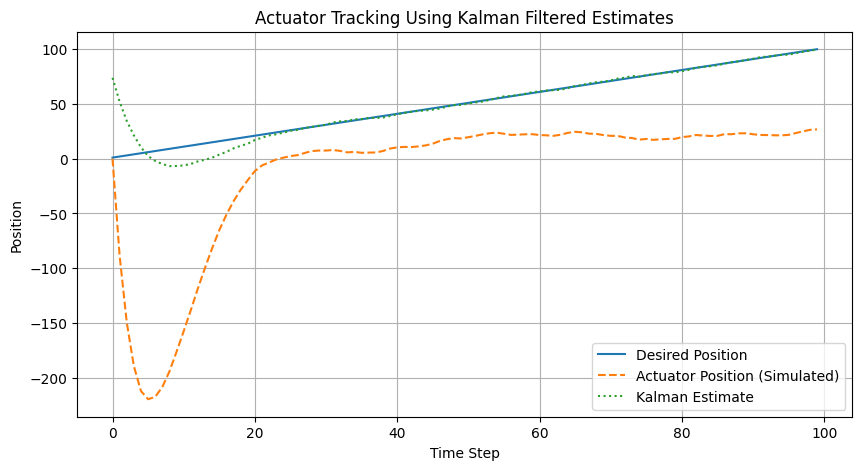

# Kalman Filter-Based Signal Processing and Actuator Simulation

This project simulates a signal processing pipeline for noisy sensor data using a **Kalman Filter**, then feeds the filtered estimates into a feedback controller that drives a simulated actuator. The goal is to demonstrate how estimation techniques improve system performance in closed-loop control applications.

---

## ⚙️ Project Overview

- Simulates noisy 1D position measurements (sensor readings).
- Applies a **Kalman Filter** to estimate true position and velocity.
- Implements a simple **proportional controller** to generate control commands.
- Simulates actuator response over time and visualizes tracking performance.
- Shows how filtering enhances actuator stability and accuracy.

---

## 📂 Repository Structure

kalman-filter-sensor-actuator-simulation/
├── Kalman_Filter_Sensor_Simulation.ipynb # Main simulation notebook
├── kalman_actuator_tracking.png # Example output plot (optional)
├── README.md # Project documentation
└── .gitignore # Ignore virtualenv, notebooks checkpoints, etc.
---

## 🛠️ Technologies Used

- Python 3.x  
- Jupyter Notebook  
- Libraries: `numpy`, `matplotlib`, `filterpy`  

---

## 📈 Example Output

### Actuator Tracking Performance

The actuator uses the Kalman-filtered position to generate control actions and track the desired trajectory. The filtered estimates significantly improve stability compared to raw sensor readings.

---

## ▶️ How to Run

1. Clone the repository:  
   `git clone https://github.com/Arman-Rajaei/kalman-filter-sensor-actuator-simulation.git`

2. Install dependencies:  
   `pip install numpy matplotlib filterpy`

3. Open `Kalman_Filter_Sensor_Simulation.ipynb` in Jupyter Notebook.

4. Run all cells to simulate the system and generate output.

---

## 📌 Purpose

This project demonstrates practical **state estimation** and **control system** design using a **Kalman filter** and simulated actuator feedback. It aligns well with roles focused on:
- Control engineering  
- Signal processing  
- Robotics and automation  
- Space or embedded systems engineering

---

## 🧑‍💻 Author

**Arman Rajaei**
